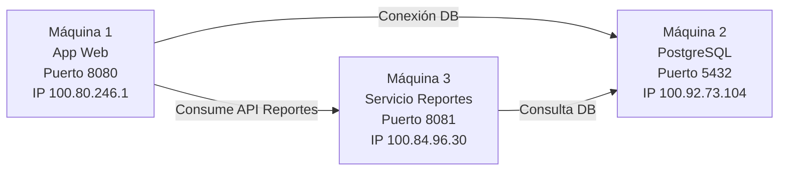
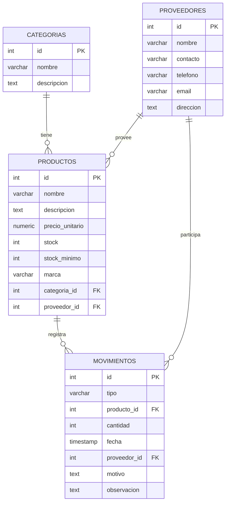

# NextCore Inventory System

Sistema distribuido de gestión de inventario desarrollado con arquitectura **multi-host**, Docker y Tailscale.

---

# 1. Descripción del Proyecto

NextCore es un sistema de inventario para gestión de productos (laptops), categorías, proveedores y movimientos de stock.

Arquitectura distribuida en 3 máquinas:

- Máquina 1 → Aplicación Web (React + API REST)
- Máquina 2 → Base de Datos PostgreSQL
- Máquina 3 → Servicio de Reportes independiente

---

# 2. Arquitectura del Sistema



---

# 3. Diagrama de Base de Datos (ER)



---

# 4. Variables de Entorno

## Máquina 2 – Base de Datos

```env
DB_NAME=nextcore
DB_USER=postgres
DB_PASSWORD=macarjer26
```

## Máquina 3 – Reportes

```env
DB_HOST=100.92.73.104
DB_PORT=5432
DB_NAME=nextcore
DB_USER=postgres
DB_PASSWORD=macarjer26
```

## Máquina 1 – App Web

```env
DB_HOST=100.92.73.104
DB_PORT=5432
DB_NAME=nextcore
DB_USER=postgres
DB_PASSWORD=macarjer26

REPORT_SERVICE_URL=http://100.84.96.30:8081
```

---

# 5. Instrucciones de Despliegue Paso a Paso

## 🔹 Paso 1 – Instalar dependencias

En las 3 máquinas instalar:

- Docker Desktop
- Tailscale

Verificar IP:
```
tailscale status
```

---

## Paso 2 – Levantar Base de Datos (Máquina 2)

```
cd base-datos
docker compose up -d --build
```

Verificar:
```
docker ps
```

---

## Paso 3 – Levantar Servicio de Reportes (Máquina 3)

```
cd reportes
docker compose up -d --build
```

---

## Paso 4 – Levantar Aplicación Web (Máquina 1)

```
cd nextcore
docker compose up -d --build
```

Abrir:

```
http://100.80.246.1:8080
```

---

# 6. Pruebas de Conectividad

## Verificar Base de Datos

En Máquina 1 o 3:

```powershell
Test-NetConnection 100.92.73.104 -Port 5432
```

Debe devolver:

```
TcpTestSucceeded : True
```

## Verificar Servicio de Reportes

```
http://100.84.96.30:8081
```

---

# 7. Evidencias Recomendadas

- Captura Tailscale mostrando 3 máquinas conectadas
  
- Captura pgAdmin con tablas
  
  
  
  
- Captura App Web funcionando
  
  
  
  
  
  
- Captura Reportes generados
  
---

# 8. Responsables

- Mattias Garces → Máquina 1
- Carlos Gordillo → Máquina 2
- Jeremias Cabot → Máquina 3
